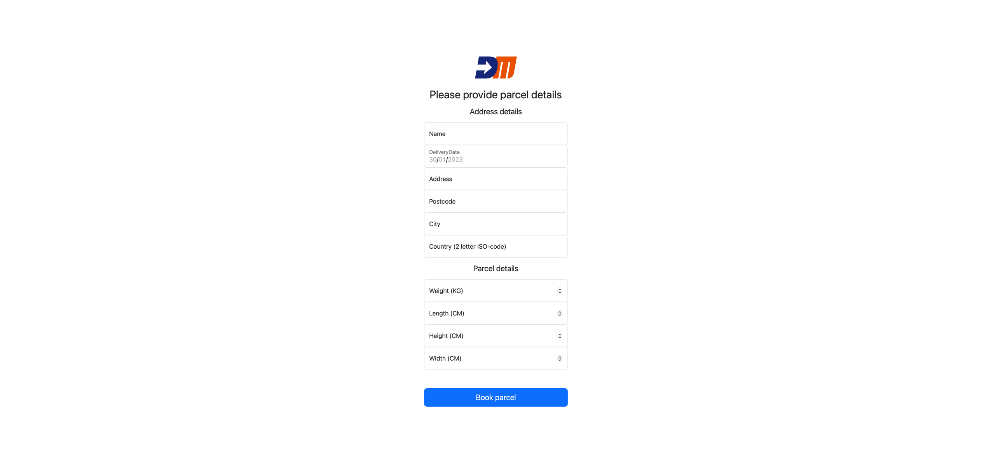
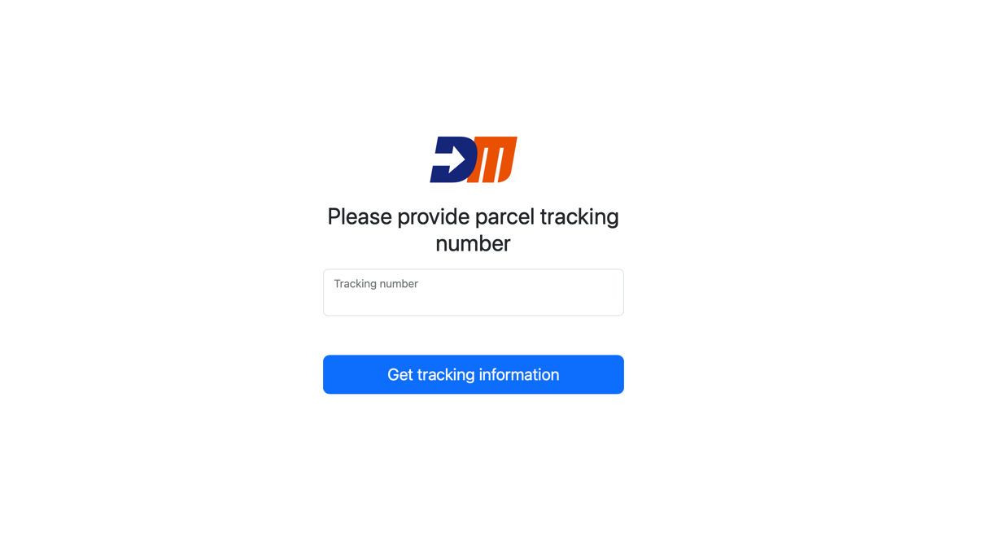

Link naar back-end: https://github.com/williamvdm/challenge_backend
# Challenge

## Introductie
DeliveryMatch is gekoppeld aan veel externe systemen, het werk dat je uitvoert bij DeliveryMatch bestaat dan ook uit het koppelen van externe systemen. Je werk zal bestaan uit zowel backend als frontend development.

## Uitleg
Je moet voor deze challenge 2 kleine applicaties bouwen. De backend moet een REST API worden waarbij je parcels kan aanmelden. Als een parcel word aangemeld word er een uniek tracking nummer gegenereerd en terug gegeven in de response. Vervolgens moet er ook een endpoint zijn waarbij je de status van een parcel kan ophalen aan de hand van het trackingnummer. De frontend is een PHP website die met jouw backend moet gaan communiceren.
## Frontend
De frontend bestaat uit 2 vooraf gemaakte pagina's namelijk: 

[`/index.php`](./src/index.php)
Deze pagina is om jouw parcels aan te melden bij je eigen gemaakte backend. Het form wordt verwerkt in [`book_parcel.php`](./src/actions/book_parcel.php). Hier moet jij zelf de logica schrijven voor het aanmelden bij je eigen backend. Dit moet gebeuren via het `POST /parcel` endpoint


[`/tracking.php`](./src/tracking.php)

Op deze pagina kun je de status van je parcel opvragen door het trackingnummer te gebruiken dat je terug krijgt nadat je een parcel hebt aangemeld. Het form wordt verwerkt in [`track_parcel.php`](./src/actions/track_parcel.php). Hier moet je zelf de logica schrijven voor het opvragen van de status via het backend endpoint `GET /parcels/{trackingNumber}`.


In principe hoef je vrij weinig aan te passen aan de HTML je bent echter wel vrij om de layout of teksten te veranderen. Wat je niet mag veranderen zijn de beschikbare velden in het form. Je mag hier dus niets weghalen of toevoegen. 
## Backend
Voor de backend ben je helemaal vrij in welke programmeertaal, framework en database je gaat gebruiken. Het is de bedoeling dat het een REST API word met de volgende endpoints.

`POST /parcels`

request:
```json
{
  "name": "string",
  "deliveryDate": "date",
  "deliveryAddress": {
    "street": "string",
    "houseNumber": "int",
    "houseNumberExtension": "string",
    "city": "string",
    "country": "string",
    "postcode": "string"
  },
  "weight": "int",
  "dimension": {
    "height": "int",
    "length": "int",
    "width": "int" 
  }
}   
```

response:
```json
{
  "trackingNumber": "string"
}
```

`GET /parcels/{trackingNumber}`

response:
```json
{
  "name": "string",
  "deliveryDate": "date",
  "deliveryAddress": {
    "street": "string",
    "houseNumber": "int",
    "houseNumberExtension": "string",
    "city": "string",
    "country": "string",
    "postcode": "string"
  },
  "weight": "int",
  "dimension": {
    "height": "int",
    "length": "int",
    "width": "int" 
  },
  "trackingNumber": "string",
  "status": "string"
}
```

## Waar moet je op letten
- [ ] Clean code. De code moet leesbaar en begrijpbaar zijn. Voeg comments toe wanneer dit niet lukt.
- [ ] Data validatie
- [ ] REST standard
- [ ] Security
- [ ] Wees duidelijk naar je gebruikers, als er wat fout is gegaan laat zo goed mogelijk weten wat er mis is gegaan.
- [ ] Maak een README.md aan in je backend repo. Geef hier instructie van hoe we jouw (backend) applicatie kunnen runnen.

## Getting started (Docker)
1. Fork deze repo.
2. `docker-compose up -d` voor het starten van de PHP applicatie.
3. Open [http://localhost:8000](http://localhost:8000)

## Getting started
1. Fork deze repo.
2. Mac: https://www.mytecbits.com/apple/macos/launch-a-php-website
2. Windows: https://www.youtube.com/watch?v=tcoIVp1eNgM

4. Maak een repo voor je eigen backend. Zorg dat deze public is.
5. Voeg een link naar je backend repo toe aan deze readme.

